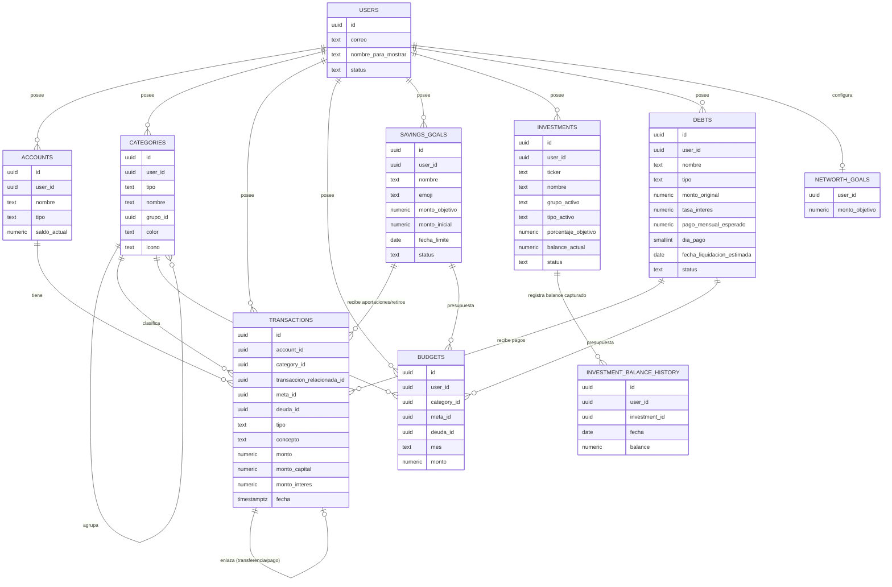

---

## status: activo last-updated: 2026-08-23

> **Nota de arquitectura (2026-08-22):** con el cierre del módulo [[ahorros-y-metas]] se aprovechó el momento para completar la traducción a **Postgres/Supabase** de las tablas que quedaban documentadas en sintaxis Mongo heredada de su fase de requerimientos (`accounts`, `categories`, `transactions`, `budgets`) — las cuatro ya estaban construidas y en uso real sobre Postgres desde antes; solo el registro no reflejaba esa realidad. `savings_goals` se documenta directamente en Postgres desde su creación. Con esto, **todo el registro queda en sintaxis Postgres nativa** y ya no existe una tarea de traducción pendiente. Los casos de uso, reglas de negocio, validaciones y mensajes de error de ningún módulo cambian por esta traducción — es exclusivamente una actualización de tipos y terminología (`ObjectId → uuid`, `_id → id`, `number → numeric(14,2)` para montos, índices dispersos de Mongo → índices únicos parciales de Postgres). Esta traducción es razonada a partir de lo ya documentado, no una lectura directa del esquema vivo en Supabase — vale la pena una verificación rápida contra las tablas reales antes de ejecutar cualquier `ALTER`/`CREATE`, por si algún nombre o convención se ajustó sobre la marcha en sesiones anteriores de Claude Code.

# Registro del modelo de datos

Registro acumulativo de tablas, campos, relaciones e índices definidos a lo largo de los documentos de requerimientos (`docs/prd/`). Se actualiza al cerrar cada chat de módulo, antes de subir el documento correspondiente a Project Knowledge. Ningún módulo redefine una tabla desde cero — todos leen y extienden lo que ya existe aquí.

## Índice de numeración

Consultar y actualizar esta tabla antes de iniciar un módulo nuevo — evita colisiones entre numeraciones asignadas en chats separados.

|Contador|Último usado|Módulo de origen|
|---|---|---|
|Casos de uso (CU-XXX)|CU-068|dashboard|
|Reglas de negocio (RN-XXX)|RN-256|dashboard|
|Errores de validación (VALIDATION_XXX)|VALIDATION_037|dashboard|
|Errores de autenticación/autorización (AUTH_XXX)|AUTH_003|auth|
|Errores de lógica de negocio (BIZ_XXX)|BIZ_033|creditos-deudas|
|Errores de sistema (SYS_XXX)|SYS_001|cuentas|

> Nota: el módulo `auth` no generó códigos nuevos de `VALIDATION_XXX` ni `BIZ_XXX` — el ingreso se resuelve enteramente con OAuth de Google y códigos `AUTH_XXX`, sin formularios propios que validar ni reglas de lógica de negocio del tipo "recurso no encontrado / conflicto".

> Nota: `VALIDATION_007` fue reservado y retirado en la revisión del 2026-07-26 (era "motivo del ajuste obligatorio", ya no aplica). No se reutiliza para evitar confusión al rastrear el historial de errores.

> Nota: `CU-021` (Calculator de distribución porcentual, módulo Presupuesto) fue documentado y luego retirado el 2026-07-31 — el usuario prefirió resolver esa distribución de forma manual, fuera de la app. Junto con él se retiraron `RN-063` a `RN-069`, `VALIDATION_018`, `BIZ_019` y `BIZ_020`. Ninguno de estos números se reutiliza.

> Nota: `CU-029` (presupuesto vs. real por grupo con filtro de periodo libre, módulo Reportes) fue documentado y luego retirado el 2026-07-31 — duplicaba el seguimiento ya existente en [[presupuesto]] (CU-022) y el filtro de fecha libre de Reportes rompía la correspondencia con el presupuesto mensual. Junto con él se retiraron `RN-092` y `RN-093`. Ninguno de estos números se reutiliza.

> Nota: `categoria_reservada` (campo de `budgets`, valor único `"ahorros"`) fue retirado el 2026-08-22 con el cierre del módulo Ahorros y Metas — cada meta activa ahora se presupuesta individualmente vía `budgets.meta_id`, igual que una categoría real. Junto con él se retiraron `RN-070`, `VALIDATION_019`, y el índice único parcial `{user_id, categoria_reservada, mes}`. Ninguno de estos se reutiliza. Por la misma razón, `RN-074` de [[presupuesto]] y `RN-087` de [[reportes]] quedan retiradas: ya no es cierto que Ahorros nunca calcule "real" (la corrección en [[reportes]] se aplicará cuando le toque su turno de construcción).

> Nota: `docs/pdr/inversiones.md` (CU-042 a CU-047, RN-140 a RN-181, `VALIDATION_026`–`VALIDATION_031`, `BIZ_026`–`BIZ_029`) se había numerado — y este índice se había editado en consecuencia — sin partir del máximo real dejado por el cierre de Ahorros y Metas (CU-048, RN-152, `VALIDATION_026`, `BIZ_026`), colisionando enteramente con él. Detectado el 2026-08-23 al iniciar la construcción del módulo Inversiones; se renumeró el documento completo a `CU-049`–`CU-054`, `RN-153`–`RN-194`, `VALIDATION_027`–`VALIDATION_032`, `BIZ_027`–`BIZ_030` (detalle de la equivalencia en el historial de cambios de [[inversiones]]) y se corrigió este índice. Ningún otro documento cambió sus propios números.

> Nota (2026-08-26): `docs/pdr/dashboard.md` (pestaña Balance, CU-061 a CU-064, RN-225 a RN-240) sucede funcionalmente a `docs/pdr/reportes.md` (CU-023, CU-024, CU-025 — balance total, evolución mensual débito/efectivo, resumen de tarjetas de crédito), con reglas de negocio nuevas o corregidas (orden explícito de cards, carrusel, años navegables limitados a los que tienen datos, y el indicador de gasto mínimo mensual recalculado por ciclo de corte de la tarjeta en vez de mes calendario). Los números `CU-023`–`CU-031` y `RN-076`–`RN-097` de [[reportes]] **no se reutilizan ni se renumeran** — quedan como registro histórico de un módulo cuya navegación se retiró de la aplicación sin construirse en su forma original. El resto de [[reportes]] (pestaña Reporte Mensual: CU-027, CU-028, CU-030, CU-031) queda pendiente de resolución cuando se documente la pestaña Analytics de Dashboard.

> Nota (2026-08-26): `docs/pdr/dashboard.md` (pestaña Networth, CU-065 a CU-068, RN-242 a RN-256) no sucede a ningún CU de [[reportes]] — es territorio nuevo, [[reportes]] nunca cubrió patrimonio neto. Introduce la primera tabla nueva del módulo Dashboard, `networth_goals` (meta de Networth configurable, un registro por usuario). El resto es agregación en tiempo de consulta sobre `accounts`, `savings_goals`, `investments`, `investment_balance_history`, `debts` y `transactions` — generaliza a estas cuatro fuentes la reconstrucción histórica ya usada en Balance (RN-230) para poder graficar el Networth total a lo largo del tiempo.

## Colecciones

> Nota de terminología: se conserva el encabezado histórico "Colecciones" por estabilidad del documento, pero desde el 2026-08-22 todas las entradas de esta sección son **tablas de Postgres/Supabase** — ver nota de arquitectura al inicio del registro.

### `users`

> Sostiene el acceso cerrado de la aplicación: el alta es 100% manual, directo en esta tabla desde el dashboard de Supabase, sin panel de administración ni autoregistro. `id` queda nulo hasta el primer login exitoso, momento en el que se vincula a `auth.users.id` (interno de Supabase Auth) — esa igualdad de identificador permite que las políticas RLS de las demás tablas usen `auth.uid() = user_id` directamente, sin joins ni claims personalizados.

```json
{
  "id": "uuid"
}
```

|Campo|Tipo|Requerido|Default|Procedencia (CU)|
|---|---|---|---|---|
|`id`|uuid (nullable hasta el primer login; igual a `auth.users.id` una vez vinculado)|Sí (tras vincular)|`null`|CU-032|
|`correo`|text (único)|Sí|—|CU-032; pre-registrado manualmente antes del primer login|
|`nombre_para_mostrar`|text\|null|No|`null`|CU-032; se autocompleta con el perfil de Google en el primer login si no se definió antes|
|`status`|text (enum: `active`, `inactive`)|Sí|`"active"`|CU-032|
|`primer_login_completado`|boolean|Sí|`false`|CU-032|
|`ultimo_acceso`|timestamptz\|null|No|`null`|CU-032|
|`created_at`|timestamptz|Sí|`now()`|CU-032|
|`updated_at`|timestamptz|Sí|`now()`|CU-032|

> El control de acceso (RN-098, RN-102) se implementa mediante un **Custom Access Token Hook** de Supabase — una función de Postgres que corre en cada emisión/renovación de token, verifica `correo` + `status=active`, y aborta la emisión si no encuentra coincidencia. La revocación de sesión (logout, CU-033) y la ventana deslizante de inactividad de 15 días (CU-034) se gestionan en el esquema interno de Supabase Auth (`auth.sessions`, `auth.refresh_tokens`), fuera del alcance de esta tabla de aplicación.

**Índices**

|Campos|Tipo|Propósito|Procedencia (CU)|
|---|---|---|---|
|`correo`|Único|Localizar la fila pre-registrada por correo en cada verificación de acceso (RN-098, RN-102)|CU-032|
|`id`|Único (primary key)|Join directo con `auth.uid()` en políticas RLS del resto de tablas|CU-032|

### `accounts`

```json
{
  "id": "uuid"
}
```

|Campo|Tipo|Requerido|Default|Procedencia (CU)|
|---|---|---|---|---|
|`user_id`|uuid (FK → users.id)|Sí|—|CU-001|
|`nombre`|text|Sí|—|CU-001; editable en CU-004|
|`tipo`|text (enum: `debito`, `credito`, `efectivo`)|Sí|—|CU-001; no editable (RN-002, RN-006)|
|`saldo_inicial`|numeric(14,2)|Sí|`0`|CU-001; no editable (RN-006)|
|`saldo_actual`|numeric(14,2)|Sí|`= saldo_inicial`|CU-001; modificado por [[transacciones]] (gasto, ingreso, transferencia, pago a tarjeta, aportación/retiro de meta) o por ajuste manual (CU-006)|
|`imagen_url`|text\|null|No|`null`|CU-001; editable en CU-004|
|`color`|text (hex `#RRGGBB`)|No|`"#9CA3AF"`|CU-001; editable en CU-004; paleta de 16 predefinidos + editor libre en frontend, se guarda siempre como hex (RN-019, RN-021)|
|`excluir_de_stats`|boolean|No|`false`|CU-001; editable en CU-004; excluye de vistas agregadas (RN-016, RN-017)|
|`linea_credito`|numeric(14,2)\|null|Sí, solo si `tipo=credito`|—|CU-001; editable en CU-004 (RN-011)|
|`dia_corte`|smallint\|null (1-31)|Sí, solo si `tipo=credito`|—|CU-001; editable en CU-004 (RN-011); día fijo del mes|
|`dia_pago`|smallint\|null (1-31)|Sí, solo si `tipo=credito`|—|CU-001; editable en CU-004 (RN-011); día fijo del mes|
|`gasto_minimo_mensual`|numeric(14,2)\|null|No|`0`|CU-001; editable en CU-004 (RN-011, RN-012)|
|`status`|text (enum: `active`, `archived`)|Sí|`"active"`|CU-001; transición `active → archived` en CU-005|
|`created_at`|timestamptz|Sí|`now()`|CU-001|
|`updated_at`|timestamptz|Sí|`now()`|CU-001; se actualiza en CU-004, CU-005, CU-006|

> Campo calculado, no persistido: `disponible` (solo cuentas de crédito) = `linea_credito - abs(saldo_actual)`, calculado en CU-003 al momento de la consulta (RN-013). Reutilizado también en el resumen de tarjetas de crédito de [[reportes]] (CU-025, RN-082).

> Eliminado en revisiones previas: `institucion` (fuera de alcance del producto por completo), el valor `ahorro` del enum `tipo` (módulo propio, ver [[ahorros-y-metas]]), `moneda` (una sola moneda estándar; ver [[backlog]]), y el array embebido `historial_ajustes` (reemplazado por la tabla `transactions` — ver más abajo).

> Política RLS: `auth.uid() = user_id`.

**Índices**

|Campos|Tipo|Propósito|Procedencia (CU)|
|---|---|---|---|
|`(user_id, status)`|B-tree compuesto|Listar cuentas activas/archivadas de un usuario|CU-001; reutilizado en CU-002, CU-005, y en el resumen de cuentas de [[reportes]] (CU-023)|
|`(user_id, nombre)`|Único compuesto|Garantizar unicidad del nombre por usuario|CU-001; reutilizado en CU-004 (excluyendo el `id` propio)|

### `transactions`

> Esquema definitivo, cerrado por el módulo Transacciones (CU-013 a CU-018), que extiende el contrato mínimo introducido por Cuentas (CU-006) sin romperlo. Cualquier movimiento entre dos cuentas propias (transferencia, pago a tarjeta) se modela como **dos filas independientes enlazadas** por `transaccion_relacionada_id` — una por cuenta — en vez de un único registro con dos cuentas, para que cada cuenta consulte su propio historial sin lógica especial. **Corrección ([[ahorros-y-metas]], 2026-08-22):** la aportación o el retiro de una meta de ahorro NO sigue este patrón — una meta no es una cuenta, así que se registran como una **fila única** referenciando la meta mediante el nuevo campo `meta_id` (ver más abajo).

```json
{
  "id": "uuid"
}
```

|Campo|Tipo|Requerido|Default|Procedencia (CU)|
|---|---|---|---|---|
|`user_id`|uuid (FK → users.id)|Sí|—|CU-006|
|`account_id`|uuid (FK → accounts.id)|Sí|—|CU-006|
|`tipo`|text (enum: `ajuste`, `gasto`, `ingreso`, `transferencia`, `pago_tarjeta`, `aportacion_meta`, `retiro_meta`, `pago_deuda`)|Sí|—|CU-006 (`ajuste`); CU-013 (`gasto`, `ingreso`); CU-014 (`transferencia`); CU-015 (`pago_tarjeta`); CU-040 de [[ahorros-y-metas]] (`aportacion_meta`, flujo de captura habilitado); CU-041 de [[ahorros-y-metas]] (`retiro_meta`, nuevo); CU-060 de [[creditos-deudas]] (`pago_deuda`, nuevo)|
|`category_id`|uuid\|null (FK → categories.id)|Sí, solo si `tipo=gasto\|ingreso`|`null`|CU-013 (RN-039, RN-041); editable en CU-017 (RN-053); `null` para `ajuste`, `transferencia`, `pago_tarjeta`, `aportacion_meta`, `retiro_meta`, `pago_deuda`|
|`transaccion_relacionada_id`|uuid\|null (FK → transactions.id, self)|Sí, solo si `tipo=transferencia\|pago_tarjeta`|`null`|CU-014, CU-015 (RN-045, RN-050); enlaza las dos filas de un mismo movimiento entre cuentas; **no aplica a `aportacion_meta`/`retiro_meta`/`pago_deuda`** (corregido en [[ahorros-y-metas]] — ver `meta_id`/`deuda_id`)|
|`meta_id`|uuid\|null (FK → savings_goals.id)|Sí, solo si `tipo=aportacion_meta\|retiro_meta`|`null`|CU-040, CU-041 de [[ahorros-y-metas]] (RN-125, RN-131); mutuamente excluyente con `category_id` y `deuda_id`; no genera una segunda fila — la misma fila se consulta por `account_id` (historial de la cuenta) o por `meta_id` (historial de la meta)|
|`deuda_id`|uuid\|null (FK → debts.id)|Sí, solo si `tipo=pago_deuda`|`null`|CU-060 de [[creditos-deudas]] (RN-213); mutuamente excluyente con `category_id` y `meta_id`; misma fila consultada por `account_id` o por `deuda_id` según el historial|
|`monto_capital`|numeric(14,2)\|null|Sí, solo si `tipo=pago_deuda`|`null`|CU-060 de [[creditos-deudas]] (RN-215); reduce el saldo calculado de la deuda (RN-216); junto con `monto_interes` suma el valor absoluto de `monto`|
|`monto_interes`|numeric(14,2)\|null|Sí, solo si `tipo=pago_deuda`|`null`|CU-060 de [[creditos-deudas]] (RN-215); no reduce el saldo de la deuda — es el costo del financiamiento (RN-216)|
|`concepto`|text|Sí|—|CU-006 (fijo: "Ajuste manual" para `tipo=ajuste`); autogenerado ("Aportación a meta: {nombre}" / "Retiro de meta: {nombre}" / "Pago a deuda: {nombre}") para `aportacion_meta`/`retiro_meta`/`pago_deuda` (RN-130, RN-136 de [[ahorros-y-metas]]; RN-220 de [[creditos-deudas]])|
|`monto`|numeric(14,2)|Sí|—|CU-006; con signo desde CU-013 (RN-038): negativo = salida, positivo = entrada; editable en CU-017 (RN-052)|
|`nota`|text\|null|No|`null`|CU-013 a CU-015; editable en CU-017; máx. 140 caracteres|
|`fecha`|timestamptz|Sí|`now()`|CU-006; editable en CU-017|
|`created_at`|timestamptz|Sí|`now()`|CU-006|
|`updated_at`|timestamptz|Sí|`now()`|CU-013 en adelante; se actualiza en CU-017|

> El signo de `monto` (RN-038, RN-045) permite que sumar los movimientos de una cuenta refleje directamente su cambio de saldo, sin lógica de inferencia adicional en reportes futuros — este supuesto se confirma en la práctica con el módulo [[reportes]] (evolución de balance mensual, CU-024; agregación por grupo, CU-027 a CU-031), que reconstruye saldos y totales exclusivamente a partir de este signo, sin lógica especial. El mismo signo, invertido, es la base del cálculo de `monto_aportado_actual` en [[ahorros-y-metas]] (RN-113).

> `meta_id` es editable desde CU-017 (Editar transacción) bajo las mismas condiciones que `category_id` (RN-139 de [[ahorros-y-metas]]). CU-018 (Eliminar transacción) aplica sin cambios estructurales a `aportacion_meta`/`retiro_meta`: al ser filas únicas, la eliminación revierte `saldo_actual` de la única cuenta involucrada, sin la lógica de "transacción relacionada eliminada" que sí aplica a transferencia y pago a tarjeta.

> Política RLS: `auth.uid() = user_id`.

**Índices**

|Campos|Tipo|Propósito|Procedencia (CU)|
|---|---|---|---|
|`(account_id, fecha desc)`|B-tree compuesto|Listar movimientos de una cuenta en orden cronológico descendente|CU-006; reutilizado en CU-003, CU-016, y en [[reportes]] (evolución de balance CU-024, detalle de tarjeta CU-026)|
|`(user_id, category_id, fecha desc)`|B-tree compuesto|Consultar movimientos por categoría (reportes, listado filtrado)|CU-013; reutilizado en CU-016, y en [[reportes]] (CU-027 a CU-031)|
|`(transaccion_relacionada_id)` `WHERE transaccion_relacionada_id IS NOT NULL`|Único parcial|Localizar la fila enlazada de un movimiento entre dos cuentas|CU-014; reutilizado en CU-015, CU-017, CU-018|
|`(meta_id, fecha desc)` `WHERE meta_id IS NOT NULL`|Parcial|Listar movimientos de una meta en orden cronológico descendente|CU-040 de [[ahorros-y-metas]]; reutilizado en CU-037, CU-041|
|`(deuda_id, fecha desc)` `WHERE deuda_id IS NOT NULL`|Parcial|Listar pagos de una deuda en orden cronológico descendente|CU-060 de [[creditos-deudas]]; reutilizado en CU-057|

### `categories`

```json
{
  "id": "uuid"
}
```

|Campo|Tipo|Requerido|Default|Procedencia (CU)|
|---|---|---|---|---|
|`user_id`|uuid (FK → users.id)|Sí|—|CU-007|
|`tipo`|text (enum: `grupo`, `categoria`)|Sí|—|CU-007, CU-008; no editable|
|`nombre`|text|Sí|—|CU-007, CU-008; editable en CU-010, CU-011|
|`grupo_id`|uuid\|null (FK → categories.id, self)|Sí si `tipo=categoria`; `null` si `tipo=grupo`|`null`|CU-007 (grupo); CU-008 (categoría, obligatorio, RN-027); editable en CU-011 (RN-033)|
|`color`|text\|null (hex `#RRGGBB`)|No|`"#9CA3AF"`|CU-007; editable en CU-010; solo aplica si `tipo=grupo` (RN-024)|
|`icono`|text\|null|No|ícono genérico|CU-008; editable en CU-011; solo aplica si `tipo=categoria` (RN-028)|
|`status`|text (enum: `active`, `archived`)|Sí|`"active"`|CU-007, CU-008; transición `active → archived` en CU-012|
|`created_at`|timestamptz|Sí|`now()`|CU-007, CU-008|
|`updated_at`|timestamptz|Sí|`now()`|CU-007, CU-008; se actualiza en CU-010, CU-011, CU-012|

> `color` e `icono` son mutuamente excluyentes según `tipo` — un grupo nunca tiene `icono`, una categoría nunca tiene `color`. Ambos campos se guardan como `null` cuando no aplican, en vez de omitirse, para mantener un esquema consistente entre filas.

> Comportamiento de `status` específico de esta tabla (CU-012): ocultar un grupo archiva en cascada todas sus categorías en `status=active` (RN-034); reactivar un grupo **no** reactiva sus categorías automáticamente — se reactivan de forma individual (RN-035).

> Nota de [[reportes]]: categorías archivadas con movimientos históricos dentro del periodo consultado sí se incluyen en la distribución de gasto por categoría (CU-028) — el movimiento ya existe, independientemente del estado actual de la categoría.

> Nota (actualizada 2026-08-23): `grupo_id` se diseñó pensando en reutilizarse en Ahorros, Créditos e Inversión, pero dos de los tres módulos optaron por tabla propia: Ahorros con `savings_goals` (ver [[ahorros-y-metas]]) e Inversiones con `investments` (ver [[inversiones]], donde grupo y tipo de activo son dos taxonomías ortogonales que no caben en una jerarquía de un nivel). La reutilización directa sigue vigente como opción abierta únicamente para Créditos y Deudas. Nótese que el **grupo de categorías** llamado "Investment" sí sigue existiendo y en uso: es donde se clasifica el gasto que representa capital entrando al portafolio (RN-025, RN-094 de [[reportes]]) — no debe confundirse con el módulo [[inversiones]], que no lo referencia salvo para leer su presupuesto mensual (RN-171).

> Política RLS: `auth.uid() = user_id`.

**Índices**

|Campos|Tipo|Propósito|Procedencia (CU)|
|---|---|---|---|
|`(user_id, tipo, status)`|B-tree compuesto|Listar grupos activos/archivados de un usuario|CU-007; reutilizado en CU-009|
|`(user_id, grupo_id, nombre)`|Único compuesto|Garantizar unicidad del nombre entre grupos (`grupo_id IS NULL`) y entre categorías del mismo grupo|CU-007, CU-008; reutilizado en CU-010, CU-011|
|`(user_id, grupo_id, status)`|B-tree compuesto|Listar categorías activas/archivadas de un grupo específico; optimiza la cascada de ocultamiento|CU-008; reutilizado en CU-009, CU-012|

### `budgets`

> Modela el presupuesto por categoría real (`category_id`) y, desde el cierre de [[ahorros-y-metas]], el presupuesto individual por meta de ahorro (`meta_id`) — cada meta activa es su propio renglón presupuestable, igual que una categoría real. `category_id` y `meta_id` son mutuamente excluyentes.

```json
{
  "id": "uuid"
}
```

|Campo|Tipo|Requerido|Default|Procedencia (CU)|
|---|---|---|---|---|
|`user_id`|uuid (FK → users.id)|Sí|—|CU-019|
|`category_id`|uuid\|null (FK → categories.id)|Sí, salvo que se use `meta_id` o `deuda_id`|`null`|CU-019 (RN-058); mutuamente excluyente con `meta_id` y `deuda_id`|
|`meta_id`|uuid\|null (FK → savings_goals.id)|Sí, solo para presupuesto de una meta|`null`|CU-035/CU-036 de [[ahorros-y-metas]] (RN-137); mutuamente excluyente con `category_id` y `deuda_id`; reemplaza a `categoria_reservada` (retirado, ver índice de numeración)|
|`deuda_id`|uuid\|null (FK → debts.id)|Sí, solo para presupuesto de una deuda|`null`|CU-055/CU-060 de [[creditos-deudas]] (RN-222); mutuamente excluyente con `category_id` y `meta_id`|
|`mes`|text (`YYYY-MM`)|Sí|—|CU-019|
|`monto`|numeric(14,2)|Sí (mayor a cero)|—|CU-019 (RN-057); editable/eliminable en CU-019, copiable en CU-020|
|`created_at`|timestamptz|Sí|`now()`|CU-019|
|`updated_at`|timestamptz|Sí|`now()`|CU-019; se actualiza en CU-019 (edición), CU-020 (copia)|

> Campos calculados, no persistidos: el % de cada grupo respecto al ingreso presupuestado (RN-071, generalizado — el grupo Ahorros ahora suma los renglones `meta_id` presupuestados en vez de un valor fijo), el "real", "% consumido" y "disponible" por categoría/meta/deuda y por grupo (RN-072, RN-073, RN-138 de [[ahorros-y-metas]], RN-223 de [[creditos-deudas]]), y el "Total por asignar" del mes (RN-075) — todos derivados al vuelo, igual que `disponible` en [[cuentas]]. El "real" mensual de una meta se calcula como la suma con signo invertido de `transactions.monto` (`aportacion_meta`, `retiro_meta`) de esa meta dentro del mes (RN-138) — `monto_inicial` de la meta no participa en este cálculo mensual, al ser un acumulado histórico y no un movimiento del periodo. El "real" mensual de una deuda se calcula como la suma de `monto_capital + monto_interes` de sus movimientos `pago_deuda` del mes (RN-223) — a diferencia del saldo calculado de la deuda (que solo resta `monto_capital`), aquí se cuenta la salida de efectivo completa.

> Retirado en la revisión del 2026-07-31: la tabla `budget_group_allocations` (distribución porcentual manual por grupo, CU-021) — ver nota de `CU-021` retirado en el índice de numeración. Deudas quedó explícitamente fuera de este módulo.

> **Retirado (2026-08-22):** el campo `categoria_reservada` y su índice único parcial — ver nota en el índice de numeración. La nota histórica de [[reportes]] sobre la sexta card de Ahorros sin cálculo de "real" queda desactualizada por la misma razón; la corrección de esa card se aplicará en el turno de construcción de [[reportes]].

> Política RLS: `auth.uid() = user_id`.

**Índices**

|Campos|Tipo|Propósito|Procedencia (CU)|
|---|---|---|---|
|`(user_id, category_id, mes)` `WHERE category_id IS NOT NULL`|Único parcial|Un solo presupuesto por categoría real y mes|CU-019|
|`(user_id, meta_id, mes)` `WHERE meta_id IS NOT NULL`|Único parcial|Un solo presupuesto por meta y mes|CU-035/CU-036 de [[ahorros-y-metas]]; reemplaza a `(user_id, categoria_reservada, mes)` (retirado)|
|`(user_id, deuda_id, mes)` `WHERE deuda_id IS NOT NULL`|Único parcial|Un solo presupuesto por deuda y mes|CU-055/CU-060 de [[creditos-deudas]]|
|`(user_id, mes)`|B-tree compuesto|Consultar todos los presupuestos de un usuario en un mes|CU-019; reutilizado en CU-020, CU-022, y en el resumen mensual de [[reportes]] (CU-027)|

### `savings_goals`

> Tabla nueva, introducida por [[ahorros-y-metas]] y documentada en Postgres desde su creación. Una meta es independiente de cualquier cuenta específica — no es un tipo de `accounts` (ver el valor `ahorro` retirado del enum `tipo` de `accounts`) — cualquier cuenta de débito o efectivo puede aportarle o recibir un retiro de ella.

```json
{
  "id": "uuid"
}
```

|Campo|Tipo|Requerido|Default|Procedencia (CU)|
|---|---|---|---|---|
|`user_id`|uuid (FK → users.id)|Sí|—|CU-035|
|`nombre`|text|Sí|—|CU-035; editable en CU-038; único entre las metas activas del usuario (RN-107)|
|`emoji`|text (unicode)|No|emoji genérico|CU-035; editable en CU-038; sin catálogo cerrado, a diferencia de `categories.icono`|
|`monto_objetivo`|numeric(14,2)|Sí|—|CU-035; editable en CU-038|
|`monto_inicial`|numeric(14,2)|No|`0`|CU-035; editable en CU-038 (a diferencia de `accounts.saldo_inicial`, no editable — RN-119)|
|`fecha_limite`|date\|null|No|`null`|CU-035; editable en CU-038; solo fecha, sin componente de hora|
|`status`|text (enum: `active`, `archived`)|Sí|`"active"`|CU-035; transición `active ↔ archived` en CU-039, siempre manual (RN-124), sin relación con alcanzar `monto_objetivo`|
|`created_at`|timestamptz|Sí|`now()`|CU-035|
|`updated_at`|timestamptz|Sí|`now()`|CU-035; se actualiza en CU-038, CU-039|

> Campos calculados, no persistidos (CU-036, CU-037): `monto_aportado_actual` = `monto_inicial` menos la suma con signo de `transactions.monto` de todas las transacciones (`aportacion_meta`, `retiro_meta`) con `meta_id` igual a esta meta (RN-113); `porcentaje_ahorrado` = `monto_aportado_actual / monto_objetivo`, sin tope superior (RN-114); `monto_restante` = `monto_objetivo - monto_aportado_actual`, mostrado como mínimo $0 en pantalla (RN-115); tiempo restante hasta `fecha_limite`, solo si está definida (RN-116). Mismo patrón que `disponible`/`saldo_actual` en [[cuentas]].

> Política RLS: `auth.uid() = user_id`.

**Índices**

|Campos|Tipo|Propósito|Procedencia (CU)|
|---|---|---|---|
|`(user_id, status)`|B-tree compuesto|Listar metas activas/archivadas de un usuario|CU-035; reutilizado en CU-036|
|`(user_id, nombre)` `WHERE status = 'active'`|Único parcial|Garantizar unicidad del nombre solo entre metas activas (RN-107) — una meta archivada libera su nombre para reutilizarse|CU-035; reutilizado en CU-038|

### `investments`

> Tabla nueva, introducida por [[inversiones]]. Registra los instrumentos que componen el portafolio del usuario y su distribución objetivo. **`balance_actual` es un dato capturado manualmente**, no derivado de `transactions` (RN-143) — el valor de mercado se mueve independientemente del capital aportado, por lo que no es reconstruible desde el historial de movimientos. Esta es la primera tabla del sistema cuyo monto principal no es derivable, a diferencia de `accounts.saldo_actual` o `savings_goals.monto_aportado_actual`.

```json
{
  "id": "uuid"
}
```

|Campo|Tipo|Requerido|Default|Procedencia (CU)|
|---|---|---|---|---|
|`user_id`|uuid (FK → users.id)|Sí|—|CU-042|
|`ticker`|text|Sí|—|CU-042; editable en CU-044; único por usuario sin importar `status` (RN-140)|
|`nombre`|text|Sí|—|CU-042; editable en CU-044|
|`grupo_activo`|text (enum: `Large Cap`, `Small Cap`, `REIT`, `Developed Markets`, `Emerging Markets`, `Treasury Bonds`, `Crypto`, `Retirement`)|Sí|—|CU-042; editable en CU-044; catálogo cerrado no administrable por el usuario (RN-142)|
|`tipo_activo`|text (enum: `Stock`, `ETF`, `Bond`, `Fund`, `Crypto`, `Real Estate`, `PPR`)|Sí|—|CU-042; editable en CU-044; catálogo cerrado no administrable por el usuario (RN-142)|
|`porcentaje_objetivo`|numeric(5,2)|Sí|`0`|CU-042 (siempre 0 al crear, RN-141); editable solo en CU-045; la suma del conjunto activo debe ser exactamente 100.00 (RN-159)|
|`balance_actual`|numeric(14,2)|Sí|`0`|CU-042; editable en CU-045; **capturado manualmente, no derivado de `transactions`** (RN-143)|
|`status`|text (enum: `activo`, `inactivo`)|Sí|`"inactivo"`|CU-042 (nace inactivo, RN-141); transición `activo ↔ inactivo` en CU-045 (RN-167)|
|`created_at`|timestamptz|Sí|`now()`|CU-042|
|`updated_at`|timestamptz|Sí|`now()`|CU-042; se actualiza en CU-044, CU-045|

> Campos calculados, no persistidos (CU-043, CU-046): `total_activo` y `total_general` (RN-146, RN-147); `porcentaje_actual` = `balance_actual ÷ total_activo`, solo sobre el conjunto activo (RN-148); `diferencia` = `balance_actual − ((porcentaje_objetivo ÷ 100) × total_activo)` (RN-149); `porcentaje_del_total` de los inactivos (RN-150); el desglose de exposición por `grupo_activo` y `tipo_activo`, calculado sobre `total_general` (RN-151); `balance_actualizado_en`, derivado de `MAX(fecha)` en `investment_balance_history` (RN-152); y todo el plan de aportación de CU-046 (`faltante`, `aportacion_sugerida`, `nuevo_balance`, `nuevo_porcentaje` — RN-172 a RN-178), que es además **efímero**: ni el monto de aportación ni su reparto se persisten (RN-170). Mismo patrón que `disponible` en [[cuentas]].

> **Sin estado "archivado", a diferencia de `accounts`, `categories` y `savings_goals`.** El valor `inactivo` ya ocupa ese rol semántico (instrumento visible, que conserva capital, sin aportaciones ni participación en la distribución objetivo). La eliminación es física y solo procede sobre instrumentos inactivos (CU-047, RN-179).

> Política RLS: `auth.uid() = user_id`.

**Índices**

|Campos|Tipo|Propósito|Procedencia (CU)|
|---|---|---|---|
|`(user_id, ticker)`|Único compuesto|Garantizar unicidad del ticker por usuario **sin importar el estado** (RN-140) — a diferencia de `savings_goals.nombre`, un instrumento inactivo conserva capital y nunca debe duplicarse|CU-042; reutilizado en CU-044|
|`(user_id, status)`|B-tree compuesto|Separar instrumentos activos e inactivos en la vista de portafolio|CU-042; reutilizado en CU-043, CU-045, CU-046|

### `investment_balance_history`

> Tabla nueva, introducida por [[inversiones]]. Serie temporal de los balances capturados: una fila por instrumento y fecha de captura. **No tiene pantalla propia ni caso de uso de consulta** — existe exclusivamente para que el módulo consolidado de Dashboard + Reportes pueda reconstruir el patrimonio invertido en el tiempo (RN-166). A diferencia del saldo de cuentas de débito, que sí es reconstruible desde `transactions` (CU-024 de [[reportes]]), el valor de mercado de un instrumento no es recuperable retroactivamente si no se captura en el momento.

```json
{
  "id": "uuid"
}
```

|Campo|Tipo|Requerido|Default|Procedencia (CU)|
|---|---|---|---|---|
|`user_id`|uuid (FK → users.id)|Sí|—|CU-045|
|`investment_id`|uuid (FK → investments.id, `ON DELETE CASCADE`)|Sí|—|CU-045|
|`fecha`|date|Sí|`CURRENT_DATE`|CU-045 (RN-165); solo fecha, sin componente de hora — una sola fila por instrumento y día|
|`balance`|numeric(14,2)|Sí|—|CU-045 (RN-165); copia del `balance_actual` guardado en ese lote|
|`created_at`|timestamptz|Sí|`now()`|CU-042 (primera fila si el alta trae balance, RN-145); CU-045|
|`updated_at`|timestamptz|Sí|`now()`|CU-045; se actualiza si se guarda de nuevo el mismo día (upsert, RN-165)|

> Se escribe una fila **incluso si el balance no cambió** respecto al guardado anterior: la semántica de la tabla es "a esta fecha el instrumento valía X", y reconfirmar un valor es información válida sobre la frescura del dato (RN-152, RN-165).

> `investments.balance_actual` y `investment_balance_history.balance` **duplican deliberadamente** el valor vigente: el primero es el dato que consulta todo el módulo, el segundo es la serie temporal. Resolver el valor vigente con `MAX(fecha)` en cada consulta encarecería la vista principal sin beneficio.

> Eliminar un instrumento elimina en cascada todas sus filas de esta tabla, lo que altera retroactivamente el patrimonio invertido histórico; el diálogo de confirmación de CU-047 lo advierte de forma explícita (RN-181).

> Política RLS: `auth.uid() = user_id`.

**Índices**

|Campos|Tipo|Propósito|Procedencia (CU)|
|---|---|---|---|
|`(investment_id, fecha)`|Único compuesto|Garantizar una sola fila por instrumento y día; soporta el upsert de RN-165|CU-045; reutilizado en CU-043, CU-047|
|`(user_id, fecha)`|B-tree compuesto|Reconstruir el patrimonio invertido del usuario a una fecha dada (consumo futuro de Dashboard + Reportes)|CU-045|

### `debts`

> Tabla nueva, introducida por [[creditos-deudas]]. Registra deuda externa (automotriz, hipotecaria,
> préstamos personales) que no vive en `accounts` — retoma la nota dejada en [[transacciones]] al
> cerrarse ese módulo, que excluyó a propósito el pago a deudas externas para resolverlo aquí como
> entidad propia. A diferencia de `investments.balance_actual` (capturado manualmente, RN-143 de
> [[inversiones]]), el saldo de una deuda **sí se deriva** de `transactions` — igual que
> `savings_goals.monto_aportado_actual` — pero solo de la porción de capital de cada pago, nunca del
> interés (RN-216).

```json
{
  "id": "uuid"
}
```

|Campo|Tipo|Requerido|Default|Procedencia (CU)|
|---|---|---|---|---|
|`user_id`|uuid (FK → users.id)|Sí|—|CU-055|
|`nombre`|text|Sí|—|CU-055; editable en CU-058; único entre las deudas activas del usuario (RN-195)|
|`tipo`|text (enum: `auto`, `hipoteca`, `personal`, `otro`)|Sí|—|CU-055; editable en CU-058; catálogo cerrado no administrable por el usuario (RN-196)|
|`monto_original`|numeric(14,2)|Sí|—|CU-055; editable en CU-058 (RN-197, a diferencia de `accounts.saldo_inicial`, no editable)|
|`tasa_interes`|numeric(5,2)|Sí|`0`|CU-055; editable en CU-058; puramente informativa (RN-198)|
|`pago_mensual_esperado`|numeric(14,2)\|null|No|`null`|CU-055; editable en CU-058|
|`dia_pago`|smallint\|null (1-31)|No|`null`|CU-055; editable en CU-058 (RN-199)|
|`fecha_liquidacion_estimada`|date\|null|No|`null`|CU-055; editable en CU-058; puramente informativa (RN-200)|
|`status`|text (enum: `active`, `archived`)|Sí|`"active"`|CU-055; transición `active ↔ archived` en CU-059, siempre manual (RN-212), sin relación con que el saldo llegue a $0 (RN-204)|
|`created_at`|timestamptz|Sí|`now()`|CU-055|
|`updated_at`|timestamptz|Sí|`now()`|CU-055; se actualiza en CU-058, CU-059|

> Campos calculados, no persistidos (CU-056, CU-057): `saldo_actual` = `monto_original` menos la
> suma de `transactions.monto_capital` (`tipo = pago_deuda`) de esta deuda (RN-202) — el interés
> pagado no reduce el saldo (RN-216); `porcentaje_pagado` = `(monto_original − saldo_actual) ÷
> monto_original` (RN-203). Mismo patrón que `monto_aportado_actual` en [[ahorros-y-metas]].

> **Sin estado "archivado" ligado al saldo, igual que `investments`.** Llegar a `saldo_actual <= 0`
> no archiva la deuda automáticamente — el archivado es siempre una decisión manual (RN-204, RN-212),
> mismo criterio ya establecido para metas de ahorro (RN-137 de [[ahorros-y-metas]]).

> Política RLS: `auth.uid() = user_id`.

**Índices**

|Campos|Tipo|Propósito|Procedencia (CU)|
|---|---|---|---|
|`(user_id, status)`|B-tree compuesto|Listar deudas activas/archivadas de un usuario|CU-055; reutilizado en CU-056|
|`(user_id, nombre)` `WHERE status = 'active'`|Único parcial|Garantizar unicidad del nombre solo entre deudas activas (RN-195)|CU-055; reutilizado en CU-058|

### `networth_goals`

> Tabla nueva, introducida por [[dashboard]] (pestaña Networth). Almacena un único monto objetivo
> de Networth por usuario — sin historial de metas anteriores, a diferencia de `savings_goals` o
> `debts`, que sí acumulan movimientos a lo largo del tiempo. `user_id` es la primary key (no hay
> `id` propio): cambiar la meta es un upsert directo sobre la única fila del usuario.

```json
{
  "user_id": "uuid"
}
```

|Campo|Tipo|Requerido|Default|Procedencia (CU)|
|---|---|---|---|---|
|`user_id`|uuid (FK → users.id, primary key)|Sí|—|CU-068|
|`monto_objetivo`|numeric(14,2)|Sí|—|CU-068 (RN-254); editable, se sobreescribe (upsert)|
|`created_at`|timestamptz|Sí|`now()`|CU-068|
|`updated_at`|timestamptz|Sí|`now()`|CU-068; se actualiza en cada cambio de meta|

> Política RLS: `auth.uid() = user_id`.

**Índices**

`user_id` ya es primary key — no requiere índice adicional.

## Relaciones

|Relación|Patrón (embebido / referenciado)|Cardinalidad|Justificación|Procedencia (CU)|
|---|---|---|---|---|
|`accounts.user_id` → `users`|Referenciado (FK)|1:N (un usuario, varias cuentas)|Se consultan por separado con frecuencia; evita duplicar datos de usuario en cada cuenta|CU-001; formalizado en CU-032|
|`transactions.account_id` → `accounts`|Referenciado (FK)|1:N (una cuenta, varios movimientos)|Se consulta con frecuencia filtrando por cuenta para mostrar el historial (CU-003)|CU-006|
|`transactions.user_id` → `users`|Referenciado (FK)|1:N|Igual que `accounts.user_id`|CU-006; formalizado en CU-032|
|`categories.user_id` → `users`|Referenciado (FK)|1:N|Igual que `accounts.user_id`|CU-007; formalizado en CU-032|
|`categories.grupo_id` → `categories` (self)|Referenciado (FK)|1:N (un grupo, varias categorías)|Una sola tabla modela grupo y categoría, distinguidos explícitamente por `tipo`; deja la puerta abierta a que Créditos e Inversión la reutilicen sin rediseño|CU-007, CU-008|
|`transactions.category_id` → `categories`|Referenciado (FK)|1:N (una categoría, varios movimientos)|Un gasto o ingreso pertenece a una categoría; se consulta con frecuencia para reportes por categoría|CU-013|
|`transactions.transaccion_relacionada_id` → `transactions` (self)|Referenciado (FK)|1:1 (un movimiento, su contraparte en la otra cuenta)|Modela transferencias y pagos a tarjeta como dos filas independientes en vez de un único registro con dos cuentas, para que cada cuenta vea su propio lado del movimiento sin lógica especial|CU-014, CU-015|
|`budgets.user_id` → `users`|Referenciado (FK)|1:N|Igual que `accounts.user_id`|CU-019; formalizado en CU-032|
|`budgets.category_id` → `categories`|Referenciado (FK), nullable|1:N (una categoría, varios presupuestos mensuales)|Un presupuesto de categoría real siempre referencia una categoría existente; nullable porque un presupuesto de meta usa `meta_id` en su lugar|CU-019|
|`users.id` ↔ `auth.users.id` (interno de Supabase)|Igualdad de identificador, no tabla de mapeo|1:1|Permite que las políticas RLS de las demás tablas usen `auth.uid() = user_id` directamente, sin joins ni claims personalizados|CU-032|
|`savings_goals.user_id` → `users`|Referenciado (FK)|1:N|Igual que `accounts.user_id`|CU-035|
|`transactions.meta_id` → `savings_goals`|Referenciado (FK), nullable|1:N (una meta, varios movimientos)|Una aportación o retiro pertenece a una meta; mutuamente excluyente con `category_id`|CU-040, CU-041|
|`budgets.meta_id` → `savings_goals`|Referenciado (FK), nullable|1:N (una meta, varios presupuestos mensuales)|Un presupuesto de meta siempre referencia una meta existente; mutuamente excluyente con `category_id`; reemplaza el pseudo-registro `categoria_reservada`|CU-035/CU-036|
|`investments.user_id` → `users`|Referenciado (FK)|1:N|Igual que `accounts.user_id`|CU-042|
|`investment_balance_history.investment_id` → `investments`|Referenciado (FK), `ON DELETE CASCADE`|1:N (un instrumento, varias capturas de balance)|Serie temporal del valor de mercado capturado manualmente; el histórico carece de sentido sin su instrumento, y las filas huérfanas distorsionarían el patrimonio histórico atribuyéndolo a un instrumento inexistente|CU-045|
|`debts.user_id` → `users`|Referenciado (FK)|1:N|Igual que `accounts.user_id`|CU-055|
|`transactions.deuda_id` → `debts`|Referenciado (FK), nullable|1:N (una deuda, varios pagos)|Un pago pertenece a una deuda; mutuamente excluyente con `category_id` y `meta_id`|CU-060|
|`budgets.deuda_id` → `debts`|Referenciado (FK), nullable|1:N (una deuda, varios presupuestos mensuales)|Un presupuesto de deuda siempre referencia una deuda existente; mutuamente excluyente con `category_id` y `meta_id`|CU-055/CU-060|
|`networth_goals.user_id` → `users`|Referenciado (FK, primary key)|1:1 (un usuario, una meta)|A diferencia del resto de las tablas de usuario (1:N), la meta de Networth es un único valor sin historial — `user_id` es la propia primary key|CU-068|

> [[inversiones]] (CU-042 a CU-047) **no agrega relaciones hacia `categories`, `transactions` ni `budgets`**, por decisión explícita. `grupo_activo` y `tipo_activo` se modelan como enums propios y no como FK a `categories`, porque son dos taxonomías **ortogonales** (un instrumento tiene grupo _y_ tipo, independientes entre sí), incompatibles con la jerarquía de un nivel grupo→categoría; además, `categories` clasifica transacciones y reutilizarla contaminaría el selector de categorías al capturar un gasto. Tampoco se agrega `budgets.investment_id` (el grupo "Investment" ya se presupuesta con categorías reales, y un tercer campo mutuamente excluyente con `category_id` y `meta_id` duplicaría un mecanismo existente) ni `transactions.investment_id` (habilitaría costo promedio y rendimiento, alcance deliberadamente delegado a Yahoo Finance). Ambas quedan registradas en [[backlog]] como posibles extensiones futuras.

> [[creditos-deudas]] (CU-055 a CU-060), a diferencia de [[inversiones]], **sí agrega relaciones hacia `transactions` y `budgets`** — sigue el mismo patrón ya establecido por `savings_goals` en [[ahorros-y-metas]] (documento único vía `deuda_id`, renglón presupuestable propio vía `budgets.deuda_id`) en vez del patrón "capturado manualmente, sin relaciones" de `investments`. No se agrega relación hacia `categories`: `debts.tipo` es un enum cerrado propio (auto/hipoteca/personal/otro), no una taxonomía que deba vivir en el sistema de categorías de gasto.

> [[reportes]] (CU-023 a CU-031) no agrega relaciones nuevas — consulta `accounts`, `categories`, `transactions` y `budgets` mediante agregación en tiempo de consulta, sin persistir ningún dato derivado (balance histórico, distribución por grupo, frecuencia de transacciones, etc.). Esto queda pendiente de revisión cuando [[reportes]] incorpore el detalle de metas individuales.

> [[dashboard]] (pestaña Networth, CU-065 a CU-068) agrega una única relación nueva —
> `networth_goals.user_id → users`— y, por lo demás, solo **lee** `accounts`, `savings_goals`,
> `investments`, `investment_balance_history`, `debts` y `transactions` mediante agregación en
> tiempo de consulta, sin relaciones nuevas hacia ninguna de ellas.

## Diagrama entity-relationship



_(se agrega la entidad `USERS` tras el cierre de [[auth]], resolviendo las cuatro relaciones que quedaban pendientes desde el primer módulo. Se agrega la entidad `SAVINGS_GOALS` tras el cierre de [[ahorros-y-metas]]; `BUDGETS.categoria_reservada` fue reemplazado por `BUDGETS.meta_id` en el mismo cierre. Desde el 2026-08-22, todo el diagrama usa tipos Postgres nativos — ya no hay mezcla de notación Mongo/Postgres. Se agregan las entidades `INVESTMENTS` e `INVESTMENT_BALANCE_HISTORY` tras el cierre de [[inversiones]]: nótese que **`INVESTMENTS` solo se relaciona con `USERS` y con su propio histórico** — no toca `CATEGORIES`, `TRANSACTIONS` ni `BUDGETS`, por decisión explícita documentada en la sección de Relaciones. Se agrega la entidad `DEBTS` tras el cierre de [[creditos-deudas]], la última fase de Casos de uso y Requerimientos del alcance completo: a diferencia de `INVESTMENTS`, `DEBTS` sí se relaciona con `TRANSACTIONS` (vía `deuda_id`, mismo patrón de documento único que `SAVINGS_GOALS`) y con `BUDGETS` (vía `deuda_id`, un renglón presupuestable por deuda activa). Se agrega la entidad `NETWORTH_GOALS` tras documentarse la pestaña Networth de [[dashboard]]: única tabla del registro con relación `1:1` hacia `USERS` (`user_id` es su propia primary key, sin `id` propio) — no se relaciona con ninguna otra entidad.)_

## Conflictos sin resolver

_(ninguno por ahora. Si un módulo nuevo contradice una definición previa de un campo — ej. un tipo de dato distinto para el mismo campo — se documenta aquí con ambas definiciones en vez de sobreescribir silenciosamente, hasta que se resuelva con una decisión explícita)_

## Historial de cambios

|Fecha|Módulo|Cambio|
|---|---|---|
|2026-07-25|cuentas|Se registra la colección `accounts` (CU-001 a CU-005), sus índices y la relación `accounts.user_id → users`. Se actualiza el índice de numeración.|
|2026-07-26|cuentas|Se elimina `institucion` del esquema; se elimina `ahorro` del enum `tipo`; se agregan `linea_credito`, `dia_corte`, `dia_pago`, `gasto_minimo_mensual`; se documenta el campo calculado `disponible`.|
|2026-07-26|cuentas|Se elimina `moneda` del esquema; se agregan `color`, `excluir_de_stats` y `historial_ajustes` (embebido, relación 1:N); se actualiza el índice de numeración (RN-019, VALIDATION_008, BIZ_004, CU-006).|
|2026-07-26|cuentas|Se retira `historial_ajustes` embebido; se introduce la colección provisional `transactions` con relación `account_id → accounts`; se genera el primer diagrama ER; `color` pasa a almacenarse como hex (antes enum); se retira `VALIDATION_007` (motivo, ya no aplica).|
|2026-07-27|categorias|Se registra la colección `categories` (CU-007 a CU-012): estructura de dos niveles grupo/categoría con campo `tipo` explícito; `color` exclusivo de grupo, `icono` exclusivo de categoría (mutuamente excluyentes); `grupo_id` sí es editable (RN-033), a diferencia de `accounts.tipo`; ocultamiento en cascada de grupo a categorías sin reactivación automática (RN-034, RN-035). Se agrega nota en `transactions` sobre la futura `category_id` y sobre que pagos a tarjeta/aportaciones a metas no llevan categoría. Se actualiza el índice de numeración y el diagrama ER.|
|2026-07-30|transacciones|Se cierra el esquema definitivo de `transactions` (se retira la etiqueta "provisional"): se agregan `category_id`, `transaccion_relacionada_id` y `nota`; el enum `tipo` queda como `ajuste`, `gasto`, `ingreso`, `transferencia`, `pago_tarjeta` y `aportacion_meta` (reservado, sin flujo de captura); `monto` pasa a guardarse con signo (RN-038). Se establece el patrón de dos documentos enlazados por `transaccion_relacionada_id` para movimientos entre dos cuentas propias (transferencia, pago a tarjeta). Se agregan CU-013 a CU-018, dos índices nuevos y las relaciones `transactions.category_id → categories` y la self-referencia `transactions.transaccion_relacionada_id → transactions`. Se actualiza el diagrama ER y el índice de numeración. Cambio cruzado: se agrega el grupo semilla "Ingresos" en [[categorias]] (RN-025). Queda fuera de alcance el pago a deudas externas (automotriz, hipotecario, préstamos personales) — se resolverá en el futuro módulo de Créditos y deudas como entidad propia, no como cuenta.|
|2026-07-31|presupuesto|Se registra la colección `budgets`: presupuesto manual por categoría y mes, y pseudo-registro de Ahorros vía `categoria_reservada` (mutuamente excluyente con `category_id`). Se agregan CU-019, CU-020 y CU-022 (configurar presupuesto, copiar mes anterior, resumen mensual con % de grupo, % consumido y disponible por categoría/grupo, y "Total por asignar"). Se agrega la relación `budgets.category_id → categories` y se actualiza el diagrama ER. **CU-021** (Calculator de distribución porcentual) se documentó y luego se retiró del alcance por decisión del usuario — junto con él se retiran `RN-063` a `RN-069`, `VALIDATION_018`, `BIZ_019` y `BIZ_020`, y no se crea la colección `budget_group_allocations` que originalmente lo hubiera soportado. Deudas queda explícitamente fuera de este módulo. Se actualiza el índice de numeración hasta CU-022 / RN-075 / VALIDATION_019 / BIZ_018.|
|2026-07-31|reportes|Se documenta el módulo Reportes (CU-023 a CU-028, CU-030, CU-031): pestaña Cuentas (resumen de cuentas, evolución de balance mensual débito/efectivo, resumen de tarjetas de crédito y su detalle de gasto) y pestaña Reporte Mensual (seis cards por grupo incluyendo Ahorros, distribución de gasto por categoría, ingresos vs. gastos, frecuencia de transacciones). No se crean colecciones ni campos nuevos — módulo 100% de agregación en tiempo de consulta sobre `accounts`, `categories`, `transactions` y `budgets`. **CU-029** (presupuesto vs. real por grupo, con filtro de periodo libre) se documentó y luego se retiró del alcance por decisión del usuario, ya que duplicaba el seguimiento que ya ofrece [[presupuesto]] (CU-022) y el filtro de fecha libre rompía la correspondencia con el presupuesto mensual — junto con él se retiran `RN-092` y `RN-093`, y no se crea el endpoint `budget-vs-actual` que originalmente lo hubiera soportado. Queda fuera de alcance el reporte detallado de metas de ahorro individuales y cualquier representación de Créditos y deudas externas. Se actualiza el índice de numeración hasta CU-031 / RN-097 / VALIDATION_022 / BIZ_021.|
|2026-07-31|auth|Se documenta el módulo Autenticación (CU-032 a CU-034): login exclusivo con Google OAuth (sin contraseña ni registro público), lista blanca de acceso vía tabla `users` pre-registrada manualmente en Supabase (verificada en cada emisión de token mediante un Custom Access Token Hook, no solo en el primer login), sesión con expiración deslizante por inactividad de 15 días, y formalización del mecanismo detrás de `AUTH_001`. Se registra la tabla `users` (Postgres/Supabase), resolviendo las relaciones `user_id` pendientes desde `accounts`, `categories`, `transactions` y `budgets`. **Decisión de arquitectura:** el backend completo pasa de MongoDB a Supabase (Postgres + Supabase Auth) — al no existir código implementado en ningún módulo, el costo es exclusivamente documental. Con este módulo se completan los 6 documentos de `docs/prd/` y se cierra la fase de Casos de uso y Requerimientos. Se actualiza el índice de numeración hasta CU-034 / RN-106 / VALIDATION_022 (sin cambio) / AUTH_003 / BIZ_021 (sin cambio) / SYS_001 (sin cambio).|
|2026-08-22|ahorros-y-metas|Se registra la tabla `savings_goals` (meta con nombre, emoji, monto objetivo, monto inicial opcional, fecha límite opcional; archivado siempre manual, sin relación con alcanzar el objetivo). Se extiende `transactions`: se agrega `meta_id`; se habilita el flujo de captura de `aportacion_meta` (ya reservado) y se agrega `retiro_meta` (nuevo) al enum `tipo`; ambos se registran como fila única, por lo que se corrige `transaccion_relacionada_id` para excluir `aportacion_meta` de su condición. Se extiende `budgets`: se agrega `meta_id`, mutuamente excluyente con `category_id`; se **retira** `categoria_reservada` — junto con él, `RN-070`, `VALIDATION_019` y su índice único parcial — cada meta activa se presupuesta individualmente igual que una categoría real; por la misma razón, `RN-074` de [[presupuesto]] y `RN-087` de [[reportes]] quedan retiradas. Se agregan CU-035 a CU-041, nuevas relaciones, y se actualiza el diagrama ER. **Aprovechando el cierre de este módulo, se traduce además todo el registro a Postgres nativo** (`accounts`, `categories`, `transactions`, `budgets` — ya construidas y en uso real sobre Supabase, documentadas hasta ahora en sintaxis Mongo heredada): `_id → id`, montos a `numeric(14,2)`, índices dispersos de Mongo a índices únicos parciales de Postgres. De paso se corrige un índice mal especificado en `savings_goals` (unicidad de `nombre` debía ser parcial, solo entre metas activas — RN-107). Pendiente para cuando le toque su turno: corregir la card de Ahorros en [[reportes]]. Se actualiza el índice de numeración hasta CU-041 / RN-139 / VALIDATION_025 / BIZ_025 (AUTH_003 y SYS_001 sin cambio).|
|2026-08-23|inversiones|Se registran las tablas `investments` (instrumento con ticker único por usuario sin importar estado, nombre, grupo y tipo de activo como enums cerrados, porcentaje objetivo, balance actual y estado `activo`/`inactivo`) e `investment_balance_history` (serie temporal, una fila por instrumento y fecha, sin pantalla propia). Se agregan CU-042 a CU-047. **El módulo no ejecuta ni registra movimientos de dinero**: `balance_actual` es un dato capturado manualmente y no derivado de `transactions` (RN-143), primera vez en el sistema que un monto principal no es reconstruible — el capital que entra al portafolio se sigue registrando como `gasto` del grupo "Investment" en [[transacciones]], y [[reportes]] lo sigue excluyendo del gasto real (RN-094, confirmada sin cambios). Se establece la regla del 100% sobre el conjunto activo (RN-159), con guardado atómico por lote (RN-162, divergencia deliberada respecto al rechazo parcial de CU-019 de [[presupuesto]]), y el algoritmo de distribución de la siguiente aportación en dos fases: cubrir faltantes proporcionalmente y repartir el remanente por porcentaje objetivo (RN-173 a RN-178). El módulo **no** usa el estado `archived` del resto de las tablas — `inactivo` ocupa ese rol y la eliminación es física, solo sobre inactivos (RN-179). **Decisiones explícitas de no-extensión:** no se agrega `budgets.investment_id` (el patrón de presupuesto por ítem de [[ahorros-y-metas]] **no** se extiende a este módulo, porque el grupo "Investment" ya se presupuesta con categorías reales), no se agrega `transactions.investment_id`, y `grupo_activo`/`tipo_activo` no se modelan como FK a `categories` por ser taxonomías ortogonales. Se actualiza la nota de `categories` sobre la reutilización de `grupo_id`, que ahora aplica solo a Créditos y Deudas. Se agregan dos ítems a [[backlog]]: catálogo administrable de grupos/tipos de activo y vínculo transacción ↔ instrumento. Se actualiza el índice de numeración hasta CU-047 / RN-181 / VALIDATION_031 / BIZ_029 (AUTH_003 y SYS_001 sin cambio).|
|2026-08-24|creditos-deudas|Se registra la tabla `debts` (deuda externa —auto, hipoteca, personal, otro— con nombre único entre deudas activas, monto original editable, tasa de interés informativa, pago mensual esperado, día de pago y fecha estimada de liquidación opcionales, y estado `active`/`archived`). Se agregan CU-055 a CU-060, cerrando la fase de Casos de uso y Requerimientos del alcance completo (los 9 documentos de `docs/pdr/`). **A diferencia de `investments`, el saldo de una deuda sí se deriva de `transactions`** — se extiende el esquema con `deuda_id`, `monto_capital` y `monto_interes` (mutuamente excluyentes con `category_id`/`meta_id`), y se agrega `pago_deuda` al enum `tipo`: un pago se registra como fila única (mismo patrón que `aportacion_meta`/`retiro_meta`), pero el saldo calculado de la deuda solo resta la porción de capital (RN-202, RN-216) — el interés es el costo del financiamiento, no una reducción de lo adeudado. Se extiende `budgets` con `deuda_id`: cada deuda activa gana su propio renglón presupuestable, igual que cada meta de ahorro, con "real" mensual = capital + interés pagado en el mes (RN-223) — a diferencia del saldo de la deuda, que solo cuenta capital. El archivado es siempre manual, sin relación con que el saldo llegue a $0 (RN-204, mismo criterio que RN-137 de [[ahorros-y-metas]]). Se actualiza [[transacciones]] (enum `tipo`, campos nuevos, CU-017 editable) y [[presupuesto]] (`budgets.deuda_id`, RN-070/RN-071/RN-075/RN-115 revisadas, encabezado "Debts"). Se actualiza el índice de numeración hasta CU-060 / RN-224 / VALIDATION_035 / BIZ_033 (AUTH_003 y SYS_001 sin cambio).|
|2026-08-26|dashboard|Se documenta la pestaña Balance del módulo Dashboard, el módulo consolidado que sucede a [[reportes]] (nav item retirado sin construirse en su forma original). Se agregan CU-061 a CU-064: balance total y cards de cuentas débito/efectivo (imagen configurada, orden explícito por saldo, carrusel de overflow), evolución de balance mensual (año navegable limitado a los que tienen datos), resumen de tarjetas de crédito (utilización, disponible, mismo orden y carrusel) y evolución de gasto mensual por tarjeta. **No se crean colecciones ni campos nuevos** — 100% agregación en tiempo de consulta sobre `accounts` y `transactions`, reutilizando `accounts.dia_corte` (ya existente) para un cálculo nuevo: el indicador de gasto mínimo mensual se recalcula por **ciclo de corte de la tarjeta** en vez de mes calendario, corrigiendo RN-083/RN-084 de [[reportes]]. Los números `CU-023`–`CU-031` de [[reportes]] no se reutilizan ni se renumeran, quedan como registro histórico — el resto de ese módulo (Reporte Mensual) se resuelve cuando se documente la pestaña Analytics de Dashboard. Networth y Analytics quedan pendientes. Se agrega RN-241 (total de tarjetas de crédito, mismo patrón que RN-225) al construirse la pantalla en código. Se actualiza el índice de numeración hasta CU-064 / RN-241 / VALIDATION_035 (sin cambio) / BIZ_033 (sin cambio) / AUTH_003 (sin cambio) / SYS_001 (sin cambio).|
|2026-08-26|dashboard|Se documenta la pestaña Networth del módulo Dashboard — territorio nuevo, no sucede a ningún CU de [[reportes]]. Se agregan CU-065 a CU-068: resumen de Cash & Savings, Investments y Liabilities agrupados por tipo (metas activas + cuentas débito/efectivo; inversiones activas por `tipo_activo`; tarjetas de crédito + deudas activas por `tipo`); evolución histórica del Networth total con selector de periodo (1M/6M/YTD/1Y/All/Custom), siempre con granularidad mensual, generalizando a cuatro fuentes (cuentas, metas, inversiones, deudas) la reconstrucción "a la fecha" ya usada en Balance (RN-230) — las inversiones usan el snapshot más reciente de `investment_balance_history` anterior o igual a cada punto; comparativo Assets vs Liabilities (snapshot actual, sin historial); y meta de Networth configurable con gauge de avance (tope visual en 100%, porcentaje real sin tope en texto). **Se introduce la primera tabla nueva del módulo Dashboard**, `networth_goals` (un registro por usuario, `user_id` como primary key, sin historial de metas anteriores) — el resto sigue siendo 100% agregación en tiempo de consulta, sin más colecciones ni campos nuevos. Se resuelve explícitamente la ambigüedad de nomenclatura entre "Assets" (concepto amplio: Cash & Savings + Investments, exclusivo del comparativo) y la card "Cash & Savings" (subconjunto): se documenta como nota al inicio de la sección Networth en [[dashboard]]. Se agrega `VALIDATION_036` (rango de fechas inválido en el periodo Custom) y `VALIDATION_037` (meta de Networth ≤ 0). Se actualiza el índice de numeración hasta CU-068 / RN-256 / VALIDATION_037 / BIZ_033 (sin cambio) / AUTH_003 (sin cambio) / SYS_001 (sin cambio), la tabla de Relaciones y el diagrama ER (`NETWORTH_GOALS`, relación 1:1 con `USERS`). Analytics queda pendiente de documentar y construir — es la última pestaña del Dashboard.|

---

Documentos relacionados: [[estrategia]] · [[brief-ux]] · [[roadmap]] · [[backlog]] · [[auth]] · [[ahorros-y-metas]] · [[inversiones]] · [[creditos-deudas]] · [[dashboard]]