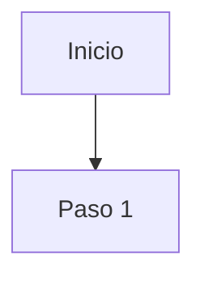

# User Flow — {{nombre del flujo}}

## Objetivo del flujo

## Pasos

1.
2.
3.

## Diagrama

## Casos borde / errores

## Referencias

- [[cuentas]] <!-- reemplaza con el requerimiento correspondiente -->
